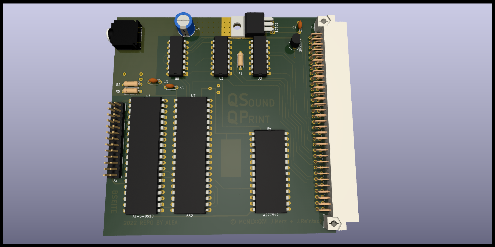
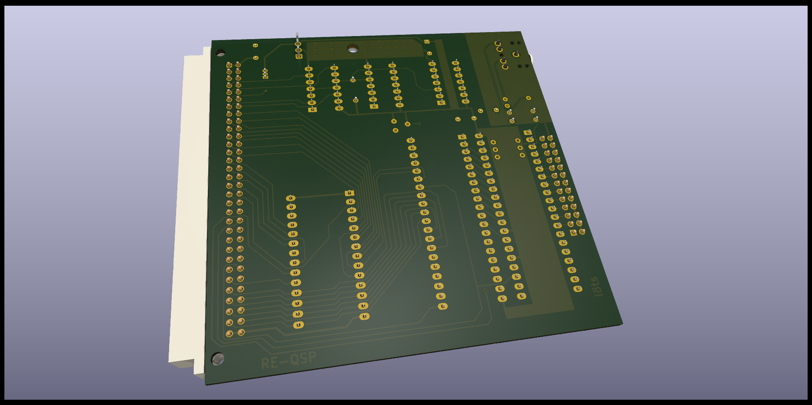

# SINCLAIR QL QsoundQprint Sound and Paralel Printer port interface

(C) 2022 Alvaro Alea Fernandez

License under: CERN Open Hardware Licence Version 2 - Strongly Reciprocal

https://ohwr.org/cern_ohl_s_v2.txt

I try to follow the original desing as much as possible, with some licenses:

- It's 10mm short, to fit in a 10x10cm, that is a lot cheaps if order PCB.
- The 7805 regulator board and the output Jack was modify.
- I use a electrolitic capacitor instead the original tantalo one.
- There are some jumper to allow a future ACB stereo mix.

Rom is no available until have a clear idea of it's copyright.

I test with Rom version 1.10, work, but superbasic command play seen to be erratic an
sometimes work and other, the same command do not work.

There is no software available for this card (as far as I know)

You can use a 2764 eprom or a 27F512 flash, that is much more cheap and easy to use.

This board user the default Motorola 68K inteface as described in the documentation of AY-3-8910 PSG. with a 6821 PIA as a glue between the QL and the PSG, in the info folder you can found aditional information about this chips or the interface.

The card have full 8bit I/O in the PSG without use, and another 8 bits in the PIA, also the pins of the paralel port are directly wired to the PSG, and are bidirectional, so can be used for other propouses.

The board use the E signal as a clock for the PSG, this cause that the PSG work in a very low frecuency, below the minimun indicated in the datasheet, and also this cause that tunes from Spectrum or other systems, can not be directly converted.

 

 

